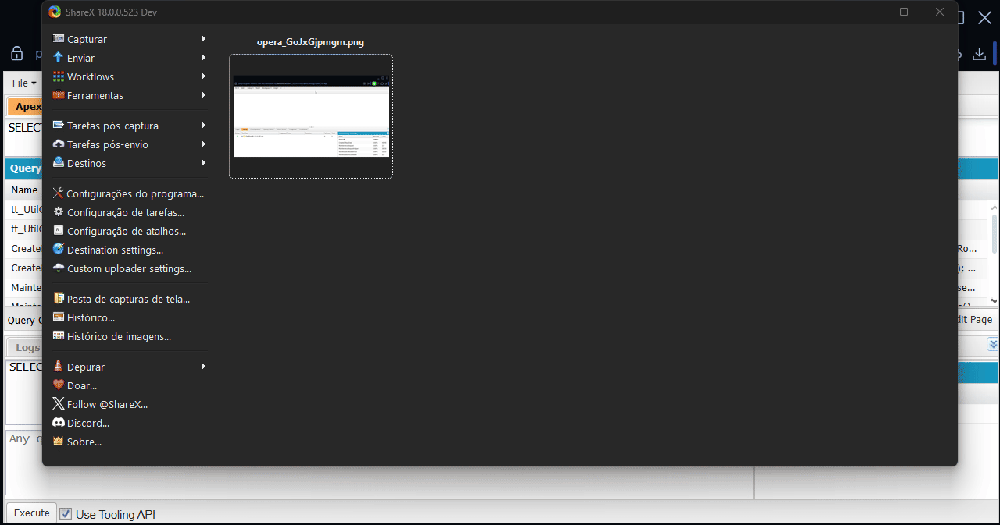
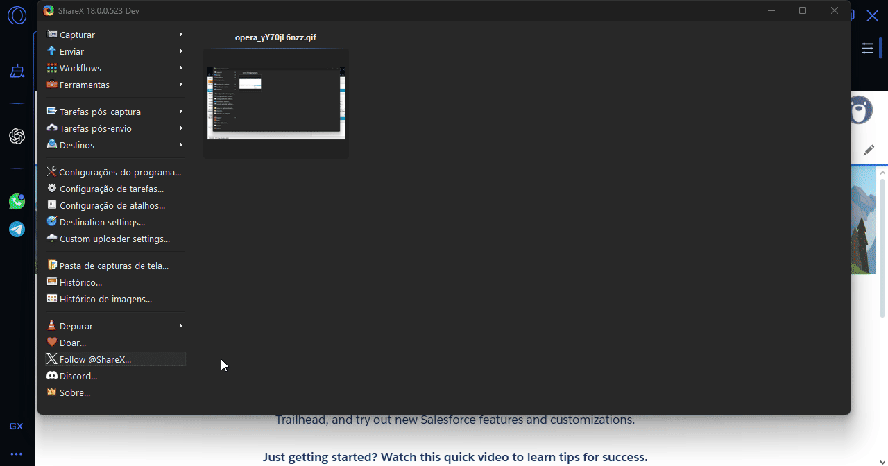
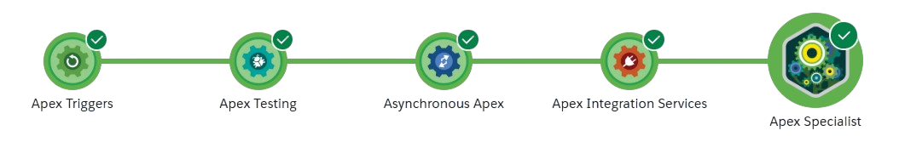

# 🚀 Superbadge: Apex Specialist

This repository contains the complete solution for the **Apex Specialist Superbadge**, developed on Trailhead as part of my hands-on learning journey to become a Salesforce Developer.

---

## ✅ What I Developed

- Scalable and efficient triggers
- Robust Apex classes
- Well-structured test classes with high coverage
- Web service integration using Apex
- SOQL and SOSL queries

---

## 🎯 Technologies Used

- Salesforce Apex
- SOQL / SOSL
- Salesforce Developer Console
- Git & GitHub
- Visual Studio Code with Salesforce Extensions
- Python

---

# 🎬 Test Demonstrations

### Class 1 - 100% Code Coverage



### Class 2 - 100% Code Coverage



---

## 📸 Superbadge Completion Proof



---

## 📚 What I Learned

- Writing scalable triggers that handle bulk operations.
- Developing Apex classes following best practices.
- Building reliable unit tests to achieve high code coverage.
- Performing SOQL and SOSL queries efficiently.
- Integrating external services using Apex callouts.

---

## 📂 Project Structure

```plaintext
/docs             → Screenshots and GIFs demonstrating tests and superbadge completion
/triggers         → Apex triggers
/classes          → Apex classes
/test-classes     → Apex test classes
README.md         → Project description
